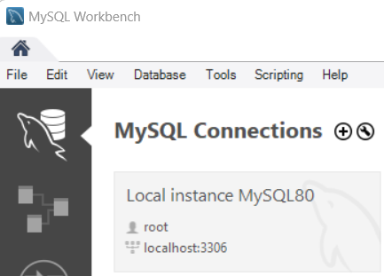
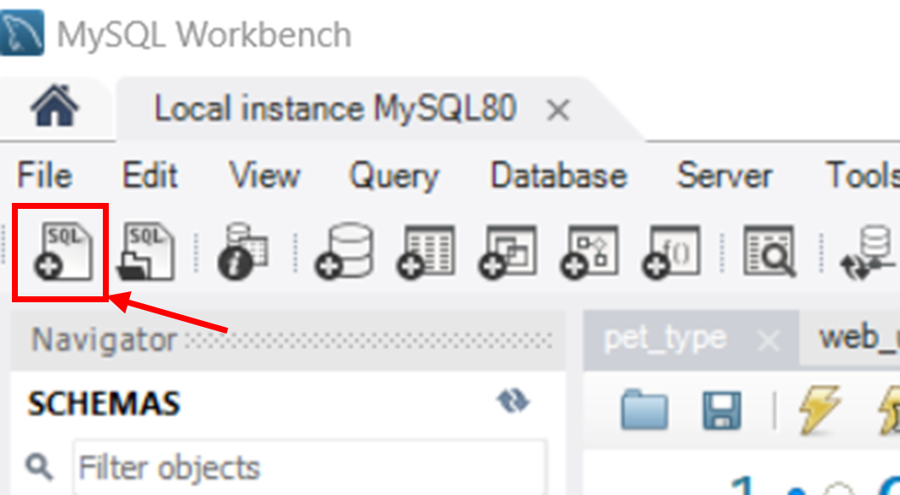
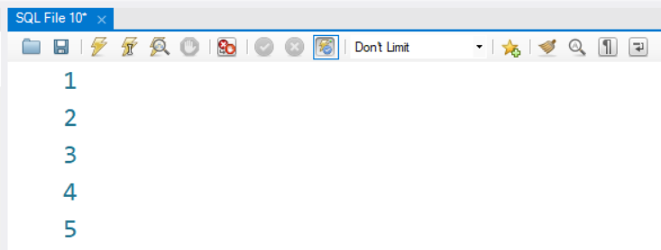
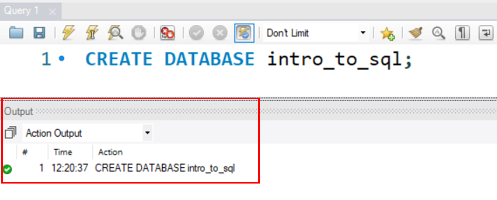
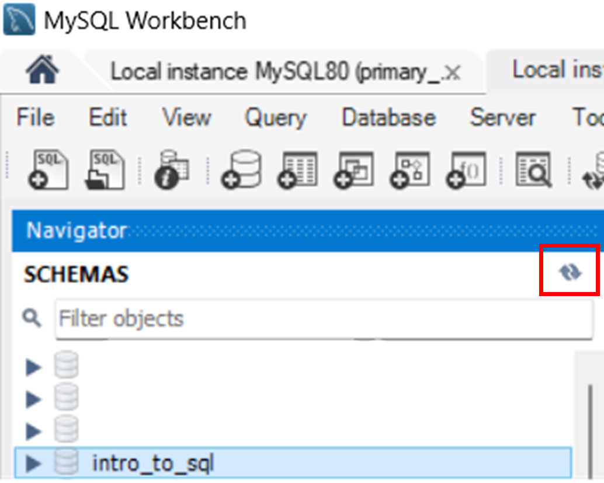
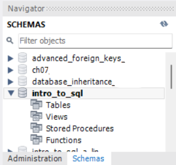
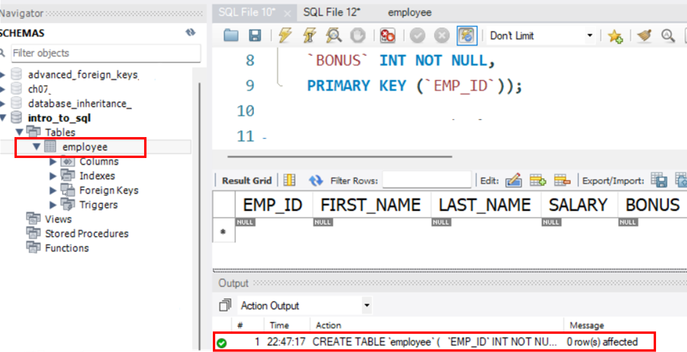
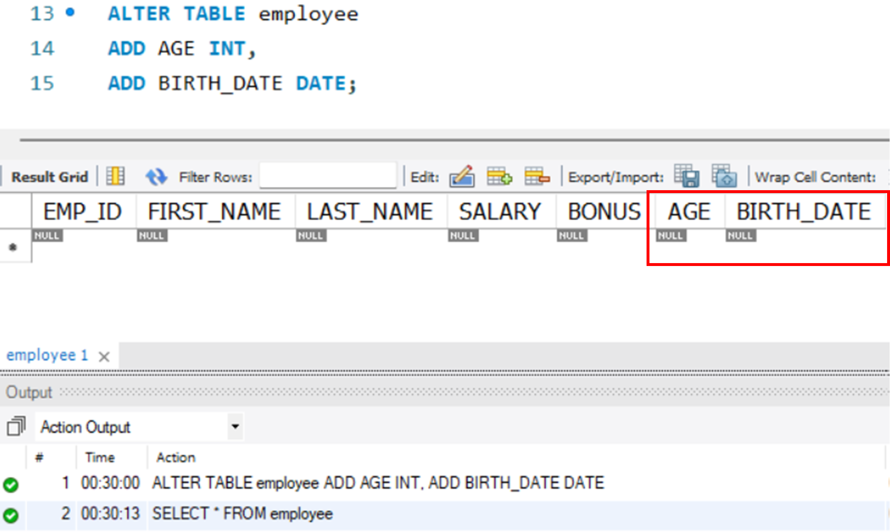
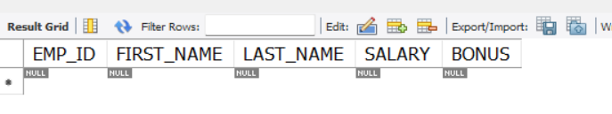

# Data Definition Language (DDL)

In this section, we will cover the following DDL commands and create a new [schema](glossary.md) and a new table in MySQL:

- `CREATE`
- `ALTER`
- `DROP`

By the end of this section, you will have a good understanding of how to use these commands to create, alter and drop your database structure effectively.

## CREATE Command

The CREATE command is used to create new objects in SQL such as schemas, tables, indexes and constraints. Instead of using both mouse and keyboard to create a schema, this time we will use only keyboard and type our commands in a [query script](glossary.md) to create a new schema and table. Let's open MySQL Workbench and get started 🔥!

### CREATE Database

1.  Open Local instance MySQL80 by single clicking the MySQL80 rectangle.

    { width="300" }

2.  Click the "new SQL file" button on the left corner of your Workbench.

    { width="300" }

    This will give us a query text window where we can type our SQL commands.

    { width="350" }

3.  Type the commands below in your query text window:

    ```sql
    CREATE DATABASE intro_to_sql;
    ```

    This will create a new schema named "intro_to_sql".

    !!!Note inline end "Execute Buttons "
        **Execute button**  is used to execute all the commands in the sql file.

        **Cursor Execute button**  is used to run a single command where the keyboard cursor is. The keyboard shortcut for this is CTRL + Enter on Windows or CMD+Enter (⌘+Enter) on Mac.

4.  Click Execute button .

    After executing a success message **"CREATE DATABASE intro_to_sql"** will display in the "Output" - "Action Output" section on the bottom of your Workbench.

    { width="400" }

5.  Click the refresh button on the right corner of the navigator to make sure the new database is added to your SCHEMAS list.

    { width="300" }

6.  Type and execut the commands below to set "intro_to_sql" as the default schema:

    ```sql
    USE intro_to_sql;
    ```

    The default schema will be bolded in your schema list.

    { width="250" }

Congratulations 🎉! You have successfully created a new schema "intro_to_sql". Next, let's add a new table to our new schema.

### CREATE Table

In this example, we will create a table named "employee" with five columns: "EMP_ID", "FIRST_NAME", "LAST_NAME", "SALARY" and "BONUS". The "EMP_ID" column is the primary key, and other columns are required (NOT NULL).

Type and execute the commands below:

```sql
CREATE TABLE `employee` ( --(1)
  `EMP_ID` INT NOT NULL AUTO_INCREMENT, --(2)
  `FIRST_NAME` VARCHAR(45) NOT NULL, --(3)
  `LAST_NAME` VARCHAR(45) NOT NULL,
  `SALARY` INT NOT NULL, --(4)
  `BONUS` INT NOT NULL,
  PRIMARY KEY (`EMP_ID`) --(5)
);
```

1. This line of code will name the new table as "employee".
2. This code will make a column called "EMP_ID" that's an integer (INT), required (NOT NULL), and increases automatically(AUTO_INCREMENT).
3. This code will make a column called "FIRST_NAME" that's a string with length <=45 ([VARCHAR(45)](glossary.md)) and can't be empty.
4. This code will make a column called "SALARY" that's an integer and can't be empty.
5. This code will set "EMP_ID" as the primary key.

Refresh the schema list in the navigator, and you will see the employee table under "intro_to_sql" schema. And a success message is shown in the "Output" section.

{ width="500" }

Good Job 🎉! You just created a new table using DDL CREATE command.

??? Note

      In SQL, by default, most commands are not case-sensitive. This means that you can use uppercase or lowercase letters interchangeably when writing commands or queries, and SQL will treat them the same way.

      For example, the following two queries are equivalent:

      ```sql
      SELECT * FROM employee;
      ```
      and
      ```sql
      select * from employee;
      ```
      However, uppercase letters are commonly used for **keywords**, such as CREATE, ALTER, DROP, SELECT, INSERT, etc. In this documentation, we will follow this rule and use uppercase letters for all keywords.

## ALTER Command

The ALTER command is used to modify the structure of existing database objects. It can add, delete, or modify columns and constraints in a table. In the example below, we will use ALTER to add columns to the "employee" table.

Type and execute the commands below:

```sql
ALTER TABLE employee
ADD AGE INT,
ADD BIRTH_DATE DATE;
```

You've added an "AGE" column and a "BIRTH_DATE" column to your employee table.

{ width="400" }

## DROP Command

The DROP command is used to remove existing database objects such as databases, tables, indexes, and constraints.

Type and execute the command below:

```sql
ALTER TABLE employee
DROP COLUMN BIRTH_DATE,
DROP COLUMN AGE;
```

In this example, we deleted both "AGE" column and "BIRTH_DATE" column in the "employee" table.

{width="400"}

Now let's try some dangerous commands. 

1. Type and execute the command below:

    ```sql
    CREATE DATABASE test_drop;
    USE test_drop;
    CREATE TABLE `test` (
      `id` INT NOT NULL AUTO_INCREMENT,
      `description` VARCHAR(45) NOT NULL,
      PRIMARY KEY (`id`)
    );
    ```
    
    This would create a new schema called "test_drop" for us to test the `DROP` command, set it as default, and create a table called "test" in this schema.

2. Then type and execute the command below:

    ```sql
    DROP DATABASE test_drop;
    ```

Your "test_drop" schema including the "test" table is permanently deleted without any warning message* when you execute the above command.

!!! danger

       The ```DROP DATABASE``` command deletes the database and all its tables and data. It will delete the specified object _permanently_, so use it with caution.

## Conclusion

We hope this section has been helpful with your learning journey on the following:

- [x] Using CREATE to create new database objects such as schema, table and column
- [x] Using USE to set a schema to default
- [x] Using ALTER to modify the database objects
- [x] Using DROP to delete database objects

In the next section, we will go through SQL DML commands, which are used to manipulate data in the database. With these commands, you can retrieve, insert, update, and delete data from your database.

Let's continue learning! 👉 **[DML](DML.md)**

_Author: Alice_