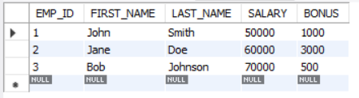
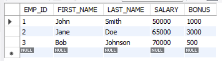
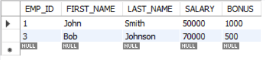

# Data Manipulation Language (DML)

In this section, we will cover some basic DML commands, which are used to insert, update, and delete rows from the tables. We will go cover the following DML commands to manipulate some data in the table:

- ```INSERT```

- ```UPDATE```

- ```DELETE```

By the end of this section, you will have a good understanding of how to use these commands to manage your table effectively. Let's continue practicing in MySQL Workbench! 

## INSERT Command

The ```INSERT``` statement is used to add new rows of data to a table. You can add commands in your current SQL file.

1. Type and execute the commands below to set the "intro_to_sql" schema back to default:

    ```sql
    USE intro_to_sql;
    ```

2. Type and execute the commands below:

    ``` sql
    INSERT INTO employee --(1)
    (FIRST_NAME, LAST_NAME, SALARY, BONUS) --(2)
    VALUES
    ('John', 'Smith', 50000, 1000),
    ('Jane', 'Doe', 60000, 3000),
    ('Bob', 'Johnson', 70000, 500); --(3)
    ```

    1. This line of code will insert some data into the "employee" table.
    2. This line of code will specify the columns you need to fill in the table.
    3. These lines of code will insert those data into the table in the order of the column.

    After you execute you should see a success message "**3 row(s) returned**" in the "Output" - "Action Output" section.

    ✔️These commands insert three new rows to the "employee" table with the data in the ```VALUES```. You should be able to see the changes in the table.

    

## UPDATE Command

The ```UPDATE``` statement is used to modify existing rows of data in a table.

Type and execute the code chunk below:

``` sql
UPDATE employee --(1)
SET SALARY = 65000 --(2)
WHERE LAST_NAME = 'Doe'; --(3)
```

1. This line of code will tell MySQL that we wil update the "employee" table.
2. In this line, you need to provide the data you want to update.
3. Specify the rows you need to update with the new data.

After you execute you should see a success message "**3 row(s) returned**" in the "Output" - "Action Output" section.

✔️This statement updates the salary for all employees with the last name "Doe" to **65000** in the "employee" table.

The table now is updated with the latest data you just changed.



!!! tip

    There is a chance that you may see the error message below: 

    **You are using safe update mode and you tried to update a table without a ```WHERE``` that uses a KEY column.  To disable safe mode, toggle the option in Preferences -> SQL Editor and reconnect.**
    
    You can either manually disable the safe mode or add a line of code above the update code chunk.

    ``` sql
    SET SQL_SAFE_UPDATES = 0;
    ```

    This line of code will also disable the safe mode for you. Then, you can try to execute the code chunk again.

!!! warning "`WHERE` Clause in `UPDATE` Command"
    Be careful with the ```WHERE``` clause in the `UPDATE` command.
    
    The ```WHERE``` clause determines which records in the table will be updated. If you forget to include a ```WHERE``` clause, the update will be applied to all records in the table, which could lead to unintended consequences. Make sure you double-check your ```WHERE``` clause to ensure that it is targeting only the records you want to update.

## DELETE Command

The ```DELETE``` statement is used to remove rows of data from a table.

Copy the code chunk below to your SQL file and execute:

``` sql
DELETE FROM employee --(1)
WHERE LAST_NAME = 'Doe'; --(2)
```

1. Tell MySQL that you are going to delete something from the "employee" table.
2. Tell MySQL which rows you want to delete.

After you execute you should see this message in your "Action Output":

**1 row(s) affected**

✔️This statement deletes all rows from the "employee" table where the last name is "Doe". Now, we should not be able to see Jane Doe's data in the "employee" table.

!!! warning "`WHERE` Clause in `DELETE` Command"

    Be careful with the ```WHERE``` clause in the `DELETE` command.
    
    The `WHERE` clause determines which records in the table will be **deleted**. If you forget to include a ```WHERE``` clause, the delete operation will remove all records in the table, which could lead to unintended consequences. Make sure you double-check your ```WHERE``` clause to ensure that it is targeting only the records you want to delete.



In order to do the next task, you need to clear all the data in the current table and insert some new data.

Copy the code chunk below to your SQL file and execute:

```sql
DELETE FROM employee;
INSERT INTO employee (FIRST_NAME, LAST_NAME, SALARY, BONUS)
VALUES
('John', 'Smith', 50000, 1000),
('Jane', 'Doe', 60000, 3000),
('Bob', 'Johnson', 70000, 500),
('Alice', 'Wonderland', 100000, 4000);
```

## Conclusion

🎇We hope this section has been helpful with your learning journey on the ```INSERT```, ```UPDATE```, and ```DELETE``` commands. You can easily insert, update, and delete table objects using these commands to fit your needs.

In the next section, we will cover SQL DQL commands, which are used to retrieve data from the database. With these commands, you can select the specific dataset.

Let's continue learning! 👉 **[DQL](DQL.md)**

_Author: Xiao_