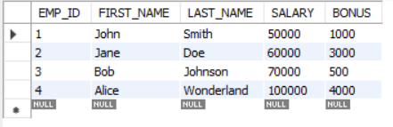
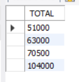

# Data Query Language (DQL)

The goal of this document is to serve as an introduction to querying a database using the ```SELECT``` statement. The ```SELECT``` statement has a number of parts and can perform many different tasks for retrieving data from the database.

A SELECT statement has the following parts or clauses:

- ```SELECT```
- ```FROM```
- ```WHERE```
- ```GROUP BY```
- ```HAVING```
- ```ORDER BY```


Each clause in the ```SELECT``` statement (aside from ```SELECT``` itself) is optional. The individual optional clauses can be combined or omitted as needed.

Although the ```SELECT``` statement can retrieve data from multiple tables at once, in this section we will focus on retrieving different types of data from a single table using only ```SELECT``` and ```FROM```.

By completing this section, you will know how to properly use the ```SELECT``` statement only comes from practice and with experience in a wide variety of scenarios.

## SELECT all data

```SELECT``` and show all rows and all columns from a single table is one of the simplest ```SELECT``` statements implementing only 1 of the optional clauses - the ```FROM``` clause.

Right after the SELECT keyword we use an asterisk **'\*'** to indicate all of the columns.

The syntax for this scenario is shown below:

```sql
SELECT * FROM <table>;
```

Let's see all the rows and columns for the employee table.
Copy and execute

```sql
SELECT * FROM employee;
```

You should get back all 4 employee rows and all 5 columns (EMP_ID, FIRST_NAME, LAST_NAME, SALARY, BONUS).



!!! info

    Remember that, although UPPERCASE and lowercase are both permitted, by convention we use UPPERCASE for ```SELECT``` keyword clauses like ```SELECT``` and ```FROM```. This helps us with readability.

## SELECT specific columns

```sql
SELECT {column1,column2…}
FROM <table>;
```

Let's try this using employee table. We want to get back the employee names (last and first) and their salary.

Copy and execute the following command:

```sql
SELECT FIRST_NAME, LAST_NAME, SALARY 
FROM employee;
```

You should get back all 4 customer rows but only 3 columns (FIRST_NAME, LAST_NAME, SALARY).


## SELECT computed columns

We can retrieve all the rows from a table and some of the columns, but those columns could include a calculation to compute a derived value.
Remember derived values are derived from other columns and/or functions.

### CONCAT

For good database design, we split people's names into first name and last name. But what if we want to recombine those into a single name? We could add the text for first name together with the text from last name (also known as concatenating 2 strings together).

The syntax for this scenario is shown below:

```sql
SELECT CONCAT(column1, ' ', column2) FROM <table>;
```

In the result, MySQL doesn't know what to call the column and so it names it based on the function we used. We can easily fix this, by giving the column an alias. An alias is just a nickname for the column so it looks better in the result.

Copy and execute

```sql
SELECT CONCAT(FIRST_NAME, ' ', LAST_NAME) AS "Full Name" 
FROM employee;
```


By adding the AS "Full Name" after the calculation of the derived value, we'll see our alias instead of "No column name". You should put double quotes around your alias, if your alias includes spaces.

### CALCULATION

Sometimes, we need to get some derived values from the database. But we don't want to store those derived values into our database because it will take up more space of our database. Instead, we can directly calculate those values and only get the value we want. 

An example syntax for this scenario is shown below:

```sql
SELECT (column1 + column2) FROM <table>;
```

Let's see what is the total each employee will receive by executing the code below.

```sql
SELECT (SALARY + BONUS) AS TOTAL
FROM employee;
```



This gives us the total for each employee in the employee table by calculating the salary plus the bonus.

## Conclusion

We hope this section has been helpful with your deep learning on the ```SELECT``` commands. You can retrieve and manipulate the data you get from the databases. There are more options of the ```SELECT``` clauses, such as ```WHERE```, ```GROUP BY```, and ```ORDER BY``` for you to explore.