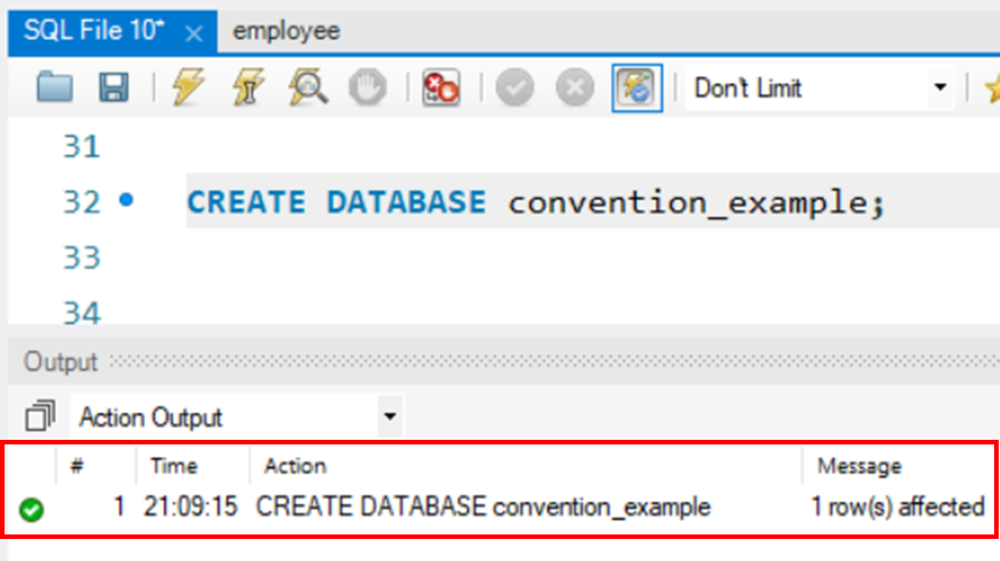

# Introduction

👋 Welcome to this documentation on [DDL](DDL.md), [DQL](DQL.md), and [DML](DML.md) - three essential components of the Structured Query Language (SQL) language that are used to manage [relational databases](glossary.md). By reading this document, you will gain an understanding of the basics of SQL syntax that are common to all relational databases, and learn how to perform common operations on a database using SQL. So, let's dive into the world of SQL!

> **SQL** is a standard language for storing, manipulating, and retrieving data in databases. Apart from querying data, the language serves several other purposes in database management operations, such as creating, modifying, and removing records or [database objects](glossary.md), defining relationships between objects, and setting constraints.
>
> Therefore, the language is multi-functional, enabling developers to carry out various data manipulation and management tasks within a database.
>
> SQL commands are classified into five categories based on their purpose:
>
> - **Data Definition Language (DDL)** - used to define the database schema and structure (`CREATE`, `ALTER`, `DROP`).
> - **Data Manipulation Language (DML)** - used to manipulate data within the database (`INSERT`, `UPDATE`, `DELETE`).
> - **Data Query Language (DQL)** - used to retrieve data from the database (`SELECT`).
> - **Data Control Language (DCL)** - used to control access to the database (`GRANT`, `REVOKE`).
> - **Transaction Control Language (TCL)** - used to manage database transactions (`COMMIT`, `ROLLBACK`, `SAVEPOINT`).

In this documentation, we will be focusing specifically on the first three categories of SQL commands: DDL, DML, and DQL. These categories are particularly important for building and managing relational databases, as they allow you to define the structure of your database, retrieve data from it, and manipulate that data as needed.

## Intended Users

This documentation is aimed at two main groups of users:

- Relational database beginners who are just starting to learn SQL and want to gain a deeper understanding of the language.
- Software development teams working on small or medium-sized web applications, who want to improve their skills in using SQL for building and managing databases.

Whether you are a complete newcomer to SQL or a seasoned developer looking to enhance your skills, this documentation will provide you with a comprehensive guide to using DDL, DQL, and DML effectively in your database management tasks.

## Prerequisite Knowledge and Skills

Up to this point, you should be able to perform the following tasks using the mouse in the [MySQL workbench](glossary.md):

- Create database objects in MySQL Workbench
- Create [Entity Relationship Diagrams](glossary.md)
- Add [primary keys](glossary.md) and [foreign keys](glossary.md)
- Add [constraints](glossary.md) to tables
- Familiar with data types in MySQL

## Software Requirements

While SQL is a widely used language that can be implemented in many software applications, in this documentation, we will specifically focus on using **MySQL Workbench**.

If you haven't installed MySQL Workbench yet, you can download the latest version (v8.0.32) from the link 👉 [MySQL Workbench Installation](https://dev.mysql.com/downloads/workbench/), and follow the installation steps here 👉 [Workbench Installation Guide](https://www.simplilearn.com/tutorials/mysql-tutorial/mysql-workbench-installation)

## Procedures Overview

Below is a summary of the main sections covered in this documentation:

- **[DDL](DDL)**
- **[DML](DML)**
- **[DQL](DQL)**
- **[Troubleshooting](troubleshooting)**
- **[Glossary](glossary)**

## Typography Guidelines

1. Code blocks in this documentation may include **clickable notes**. These notes can be helpful if you need further explanation for a particular piece of code that you are unfamiliar with. Below is an example of a code block with a clickable note:

    ```sql
    SELECT FULL_NAME FROM person; --(1)
    ```

    1. Shows all rows in the "FULL_NAMe" column from the person table

2. Inline commands are presented in a monospace font to distinguish them from the regular text: `CREATE`

3. Instruction screenshots may include red squared rectangles that point to key information or message:
    <figure markdown>
    {width="400"}
    <figcaption>A success message in the "Output" - "Action Output" section is bordered by a red rectangle</figcaption>
    </figure>

4. Message blocks are used to draw your attention to relevant information:

    !!! note

        indicates important knowledge that needs to be addressed or communicated to the user.

    !!! warning

        indicates a potentially hazardous command or action that could have negative consequences, but may not necessarily result in irreversible damage.

    !!! danger

        indicates a potentially dangerous command or action that must be used with caution to avoid uncoverable results.

    !!! tip

        indicates error message information or provides tips that can help users troubleshoot common issues.

Now let's start with our first SQL component 👉 **[DDL](DDL.md)**

_Author: Alice_